# x-spreadsheet Documentation

A comprehensive, enterprise-grade web-based spreadsheet component built with HTML5 Canvas. Provides a complete Excel-like editing experience in the browser with support for formulas, formatting, cell merging, data validation, auto-filtering, freeze panes, and comprehensive keyboard shortcuts.

---

## Table of Contents

1. [Introduction](#introduction)
2. [Installation](#installation)
3. [Quick Start](#quick-start)
4. [Architecture Overview](#architecture-overview)
5. [Component System](#component-system)
6. [Data Flow](#data-flow)
7. [Features Detailed](#features-detailed)
8. [Configuration Options](#configuration-options)
9. [API Reference](#api-reference)
10. [Events System](#events-system)
11. [Data Structure](#data-structure)
12. [Formulas Reference](#formulas-reference)
13. [Cell Formatting](#cell-formatting)
14. [Data Validation](#data-validation)
15. [Keyboard Shortcuts](#keyboard-shortcuts)
16. [Toolbars Reference](#toolbars-reference)
17. [Context Menu Reference](#context-menu-reference)
18. [Auto-Filter System](#auto-filter-system)
19. [Freeze Panes](#freeze-panes)
20. [Style Management](#style-management)
21. [Undo/Redo System](#undoredo-system)
22. [Clipboard Operations](#clipboard-operations)
23. [Internationalization](#internationalization)
24. [Rendering System](#rendering-system)
25. [Expression Parser](#expression-parser)
26. [Performance Optimization](#performance-optimization)
27. [Common Patterns](#common-patterns)
28. [Troubleshooting](#troubleshooting)
29. [Migration Guide](#migration-guide)
30. [API Summary](#api-summary)

---

## Introduction

### What is x-spreadsheet?

x-spreadsheet is a **client-side JavaScript library** that renders a fully functional spreadsheet interface using **HTML5 Canvas**. Unlike DOM-based approaches, Canvas rendering provides superior performance for large datasets and complex styling operations.

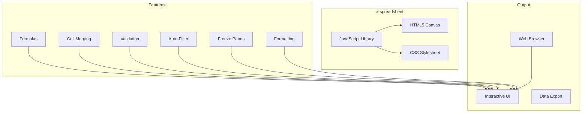

### Key Capabilities

- **Canvas-based rendering**: High-performance 2D rendering with device pixel ratio support
- **Excel-compatible features**: Formulas, cell merging, freeze panes, auto-filter, data validation
- **Full keyboard support**: Comprehensive keyboard shortcuts for efficient editing
- **Multi-sheet support**: Create and manage multiple worksheets within a single instance
- **Rich formatting**: Text styling, cell borders, number formats, alignment options
- **Data validation**: Built-in validators for list, number, date, email, phone
- **Undo/Redo**: Complete history management with unlimited undo/redo
- **Customization**: Extend toolbar with custom buttons and actions

### Version Compatibility

| Version | Status | Notes |
|---------|--------|-------|
| 1.0.x | Stable | Current stable release |
| 1.1.x | Beta | Latest beta with enhanced features |

---

## Installation

### npm Installation

```bash
npm install x-data-spreadsheet
```

### CDN Installation

#### unpkg CDN (Recommended)

```html
<!DOCTYPE html>
<html>
<head>
  <meta charset="utf-8">
  <title>x-spreadsheet Demo</title>
  <link rel="stylesheet" href="https://unpkg.com/x-data-spreadsheet@1.0.20/dist/xspreadsheet.css">
</head>
<body>
  <div id="spreadsheet"></div>
  <script src="https://unpkg.com/x-data-spreadsheet@1.0.20/dist/xspreadsheet.js"></script>
</body>
</html>
```

### Local Development

```bash
git clone https://github.com/myliang/x-spreadsheet.git
cd x-spreadsheet
npm install
npm run dev
```

---

## Quick Start

### Basic Spreadsheet Creation

```javascript
import Spreadsheet from 'x-data-spreadsheet';

// Create spreadsheet instance
const spreadsheet = Spreadsheet('#spreadsheet-container', {
  showToolbar: true,
  showGrid: true,
  showBottomBar: true
});

// Load initial data
spreadsheet.loadData([{
  name: 'Sheet1',
  rows: {
    1: {
      cells: {
        0: { text: 'Product' },
        1: { text: 'Price' },
        2: { text: 'Quantity' }
      }
    },
    2: {
      cells: {
        0: { text: 'Widget A' },
        1: { text: 100 },
        2: { text: 50 }
      }
    }
  }
}]);
```

### Complete Example with Custom Toolbar

```javascript
const spreadsheet = Spreadsheet('#container', {
  showToolbar: true,
  showGrid: true,
  showBottomBar: true,
  extendToolbar: {
    left: [
      {
        tip: 'Save',
        icon: 'data:image/svg+xml;base64,...',
        onClick: (data, sheet) => {
          console.log('Save clicked:', data);
        }
      }
    ],
    right: [
      {
        tip: 'Export',
        el: document.createElement('button'),
        onClick: (data, sheet) => {
          console.log('Export data:', data);
        }
      }
    ]
  }
});

// Listen for changes
spreadsheet.change((data) => {
  console.log('Data changed:', JSON.stringify(data));
});
```

### Read-Only Mode

```javascript
const spreadsheet = Spreadsheet('#container', {
  mode: 'read',
  showToolbar: false,
  showGrid: true,
  showBottomBar: false
});
```

---

## Architecture Overview

### High-Level Architecture

x-spreadsheet implements a **Model-View-Controller (MVC)** architecture specifically designed for canvas-based spreadsheet rendering:

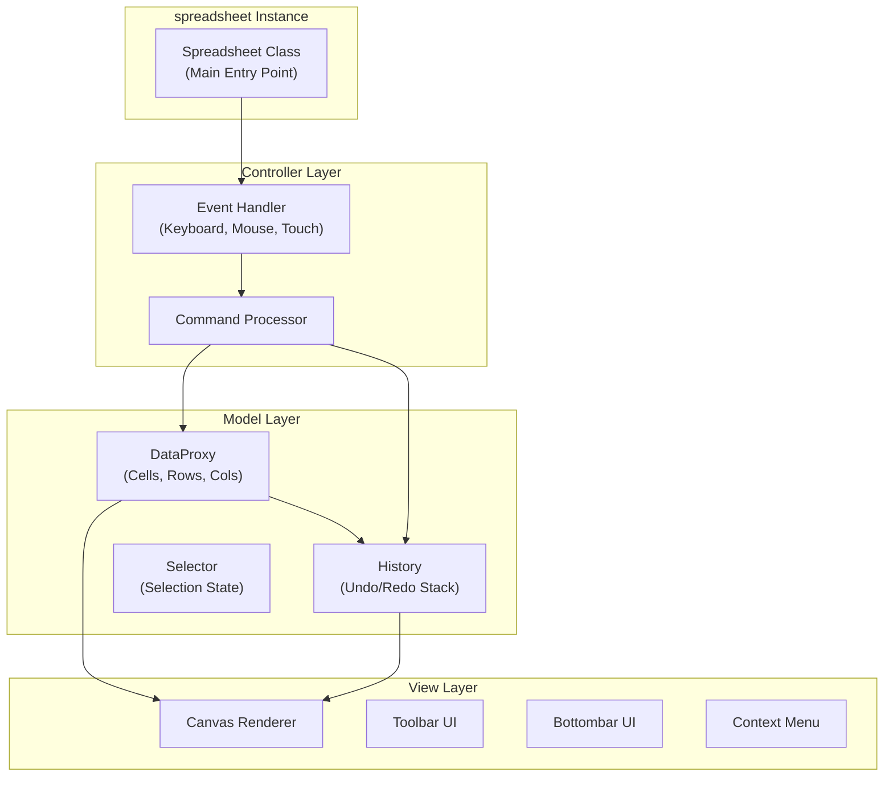

### Core Component Architecture

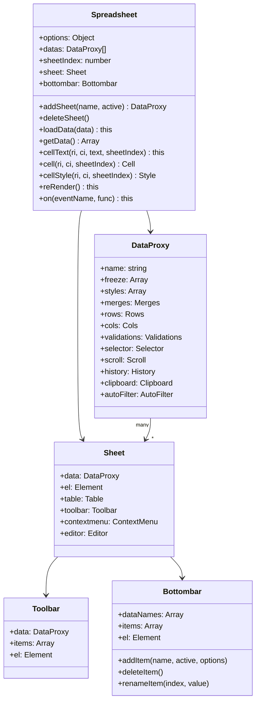

---

## Component System

### Component Hierarchy

```mermaid
flowchart TB
    subgraph Root["Root Element (div.x-spreadsheet)"]
        Toolbar["Toolbar<br/>(Formatting Buttons)"]
        Container["Sheet Container"]
        Bottombar["Bottombar<br/>(Sheet Tabs)"]
    end
    
    subgraph Toolbar
        T1["Undo/Redo"]
        T2["Print"]
        T3["Format"]
        T4["Font"]
        T5["Text Style"]
        T6["Colors"]
        T7["Border"]
        T8["Merge"]
        T9["Alignment"]
        T10["Data Tools"]
        T11["More Dropdown"]
    end
    
    subgraph Container["Sheet Container"]
        ColHeader["Column Headers"]
        RowHeader["Row Headers"]
        Canvas["Main Canvas"]
        Editor["Editor Overlay"]
        Selector["Selection"]
        Context["Context Menu"]
    end
    
    subgraph Bottombar
        Tab1["Sheet Tab 1"]
        Tab2["Sheet Tab 2"]
        Add["Add Button"]
    end
    
    Root --> Toolbar
    Root --> Container
    Root --> Bottombar
    
    Toolbar --> T1
    Toolbar --> T2
    Toolbar --> T3
    Toolbar --> T4
    Toolbar --> T5
    Toolbar --> T6
    Toolbar --> T7
    Toolbar --> T8
    Toolbar --> T9
    Toolbar --> T10
    Toolbar --> T11
    
    Container --> ColHeader
    Container --> RowHeader
    Container --> Canvas
    Container --> Editor
    Container --> Selector
    Container --> Context
    
    Bottombar --> Tab1
    Bottombar --> Tab2
    Bottombar --> Add
```

---

## Data Flow

### Complete Data Flow Diagram

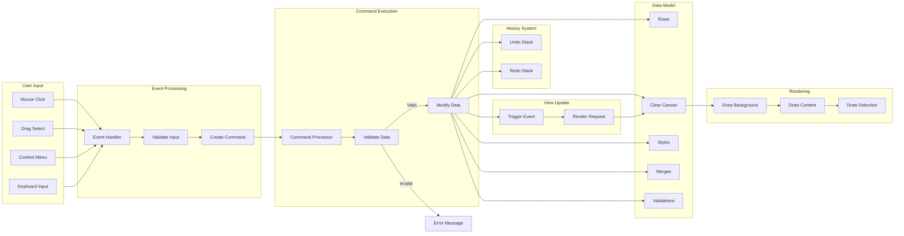

### Cell Edit Flow

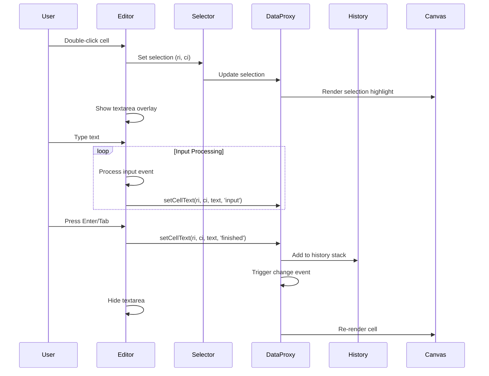

### Copy/Paste Flow

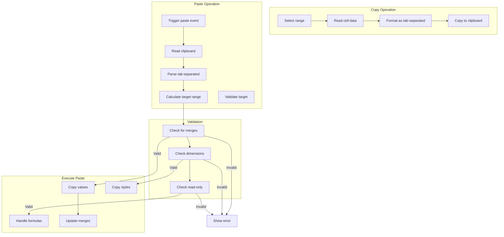

---

## Features Detailed

### 1. Cell Editing System

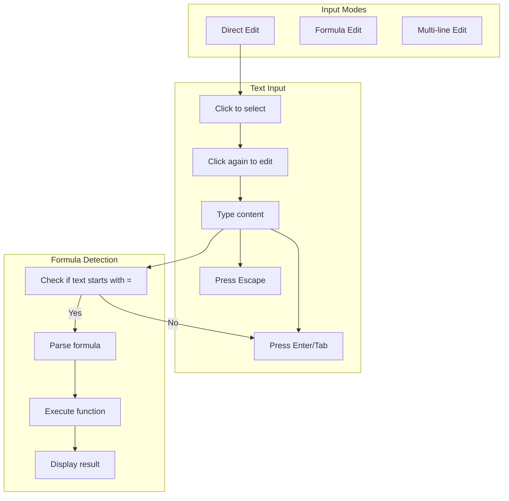

#### Selection Types

| Type | Description | Trigger |
|------|-------------|----------|
| Single | One cell | Click |
| Range | Multiple cells | Shift+Click or Drag |
| Row | Entire row | Click row header |
| Column | Entire column | Click column header |
| All | Entire sheet | Ctrl+A |

### 2. Formula Processing

```mermaid
flowchart LR
    subgraph Input["Formula Input"]
        F1["User types =SUM(A1:A10)"]
    end
    
    subgraph Parse["Formula Parse"]
        F2["Extract function name"]
        F3["Parse arguments"]
        F4["Resolve cell references"]
    end
    
    subgraph Execute["Execute"]
        F5["Get cell values"]
        F6["Apply function"]
        F7["Calculate result"]
    end
    
    subgraph Output["Display"]
        F8["Store result in cell"]
        F9["Render cell"]
    end
    
    F1 --> F2
    F2 --> F3
    F3 --> F4
    F4 --> F5
    F5 --> F6
    F6 --> F7
    F7 --> F8
    F8 --> F9
```

### 3. Rendering Pipeline

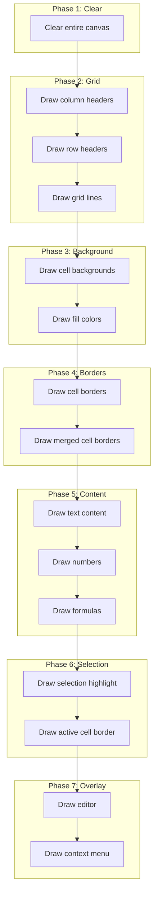

---

## Configuration Options

### Complete Options Reference

```javascript
const options = {
  // ==================== DISPLAY OPTIONS ====================
  
  // Mode: 'edit' for full editing, 'read' for read-only
  mode: 'edit',
  
  // Show/hide main toolbar
  showToolbar: true,
  
  // Show/hide grid lines
  showGrid: true,
  
  // Show/hide right-click context menu
  showContextmenu: true,
  
  // Show/hide bottom sheet tabs
  showBottomBar: true,
  
  // ==================== FOCUS OPTIONS ====================
  
  // Auto-focus on initialization
  autoFocus: true,
  
  // ==================== CUSTOM TOOLBAR ====================
  
  // Add custom buttons to toolbar
  extendToolbar: {
    left: [
      {
        tip: 'Custom Button',
        icon: 'url/to/icon.png',
        onClick: (data, sheet) => {
          // Custom action
        }
      }
    ],
    right: []
  },
  
  // ==================== VIEW DIMENSIONS ====================
  
  // Custom view dimensions
  view: {
    height: () => window.innerHeight - 100,
    width: () => window.innerWidth - 50
  },
  
  // ==================== ROW CONFIGURATION ====================
  
  row: {
    // Default number of rows
    len: 100,
    // Default row height in pixels
    height: 25
  },
  
  // ==================== COLUMN CONFIGURATION ====================
  
  col: {
    // Default number of columns (A-Z = 26, A-XX = 100+)
    len: 26,
    // Default column width in pixels
    width: 100,
    // Row number column width
    indexWidth: 60,
    // Minimum column width
    minWidth: 60
  },
  
  // ==================== DEFAULT STYLE ====================
  
  style: {
    // Default background color
    bgcolor: '#ffffff',
    // Default horizontal alignment
    align: 'left',
    // Default vertical alignment
    valign: 'middle',
    // Default text wrap
    textwrap: false,
    // Default strikethrough
    strike: false,
    // Default underline
    underline: false,
    // Default text color
    color: '#0a0a0a',
    // Default font settings
    font: {
      name: 'Arial',
      size: 10,
      bold: false,
      italic: false
    },
    // Default number format
    format: 'normal'
  }
};
```

### Default Values Summary

| Option | Default | Type | Description |
|--------|---------|------|-------------|
| `mode` | `'edit'` | String | Editing mode: 'edit' or 'read' |
| `showToolbar` | `true` | Boolean | Display formatting toolbar |
| `showGrid` | `true` | Boolean | Display grid lines |
| `showContextmenu` | `true` | Boolean | Display context menu |
| `showBottomBar` | `true` | Boolean | Display sheet tabs |
| `autoFocus` | `true` | Boolean | Auto-focus on init |
| `row.len` | `100` | Number | Initial number of rows |
| `row.height` | `25` | Number | Default row height |
| `col.len` | `26` | Number | Initial number of columns |
| `col.width` | `100` | Number | Default column width |
| `col.indexWidth` | `60` | Number | Row header width |
| `col.minWidth` | `60` | Number | Minimum column width |

---

## API Reference

### Class: Spreadsheet

#### Constructor

```javascript
new Spreadsheet(container, options)
```

**Parameters:**

| Parameter | Type | Required | Description |
|-----------|------|----------|-------------|
| container | String/HTMLElement | Yes | CSS selector or DOM element |
| options | Object | No | Configuration options |

**Returns:** Spreadsheet instance

#### Methods

##### loadData(data)

Load spreadsheet data from JSON array.

```javascript
spreadsheet.loadData([
  {
    name: 'Sheet1',
    freeze: 'B3',
    styles: [...],
    merges: [...],
    rows: {...},
    cols: {...}
  }
])
```

**Parameters:**
- `data` (Array|Object): Single sheet or array of sheets

**Returns:** Spreadsheet instance (chainable)

---

##### getData()

Get current spreadsheet data as JSON.

```javascript
const data = spreadsheet.getData();
// Returns:
// [
//   {
//     name: "Sheet1",
//     freeze: "B3",
//     styles: [...],
//     merges: [...],
//     rows: {...},
//     cols: {...}
//   }
// ]
```

**Returns:** Array of sheet data objects

---

##### cellText(rowIndex, colIndex, text, sheetIndex)

Set cell text content.

```javascript
// Set cell at row 0, column 0
spreadsheet.cellText(0, 0, 'Hello');

// Set cell with sheet index
spreadsheet.cellText(0, 0, 'World', 1);
```

**Parameters:**
- `rowIndex` (Number): Row index (0-based)
- `colIndex` (Number): Column index (0-based)
- `text` (String): Cell text content
- `sheetIndex` (Number): Sheet index (optional, default: 0)

**Returns:** Spreadsheet instance (chainable)

---

##### cell(rowIndex, colIndex, sheetIndex)

Get cell data including text and style.

```javascript
const cell = spreadsheet.cell(0, 0);
// Returns: { text: "Hello", style: 0, merge: null }
```

**Parameters:**
- `rowIndex` (Number): Row index (0-based)
- `colIndex` (Number): Column index (0-based)
- `sheetIndex` (Number): Sheet index (optional)

**Returns:** Cell object or null

---

##### cellStyle(rowIndex, colIndex, sheetIndex)

Get cell style definition.

```javascript
const style = spreadsheet.cellStyle(0, 0);
// Returns: { color: "#000000", bgcolor: "#ffffff", align: "left", ... }
```

**Parameters:**
- `rowIndex` (Number): Row index (0-based)
- `colIndex` (Number): Column index (0-based)
- `sheetIndex` (Number): Sheet index (optional)

**Returns:** Style object or null

---

##### reRender()

Force complete re-render of the spreadsheet.

```javascript
// Update cell data directly
cell.text = 'Updated';
// Force re-render
spreadsheet.reRender();
```

**Returns:** Spreadsheet instance (chainable)

---

##### deleteSheet()

Delete the currently active sheet.

```javascript
// Delete current sheet
spreadsheet.deleteSheet();
```

**Returns:** void

---

### Event System

#### on(eventName, callback)

Bind event handler to spreadsheet events.

```javascript
// Cell selection event
spreadsheet.on('cell-selected', (cell, ri, ci) => {
  console.log('Cell selected:', { ri, ci, cell });
});

// Multiple cells selection
spreadsheet.on('cells-selected', (cell, { sri, sci, eri, eci }) => {
  console.log('Range selected:', { sri, sci, eri, eci });
});

// Cell editing event
spreadsheet.on('cell-edited', (text, ri, ci) => {
  console.log('Cell edited:', { ri, ci, text });
});
```

#### change(callback)

Bind handler to any data change event (shorthand).

```javascript
// Watch for all data changes
spreadsheet.change((data) => {
  console.log('Data changed:', JSON.stringify(data));
});
```

### Static Methods

#### Spreadsheet.locale(lang, messages)

Set localization for custom language.

```javascript
// Switch to Chinese
x_spreadsheet.locale('zh-cn');

// Use custom messages
x_spreadsheet.locale('custom', {
  toolbar: {
    undo: 'Undo',
    redo: 'Redo',
    // ...
  },
  contextmenu: {
    copy: 'Copy',
    paste: 'Paste',
    // ...
  }
});
```

---

## Events System

### Available Events

| Event | Parameters | Description |
|-------|------------|-------------|
| `cell-selected` | `(cell, ri, ci)` | Single cell is selected |
| `cells-selected` | `(cell, {sri, sci, eri, eci})` | Range of cells selected |
| `cell-edited` | `(text, ri, ci)` | Cell content was edited |
| `change` | `(data)` | Any data modification occurred |

### Event Handling Examples

```javascript
// Cell selection handler
spreadsheet.on('cell-selected', (cell, ri, ci) => {
  const column = String.fromCharCode(65 + ci);  // Convert to letter
  const row = ri + 1;
  console.log(`Selected ${column}${row}:`, cell);
});

// Multiple selection handler
spreadsheet.on('cells-selected', (cell, range) => {
  console.log(`Selected range: ${range.sri}:${range.sci} to ${range.eri}:${range.eci}`);
});

// Edit handler
spreadsheet.on('cell-edited', (text, ri, ci) => {
  console.log(`Edited cell ${ri},${ci}: "${text}"`);
});

// Data change watcher
spreadsheet.change((data) => {
  // Auto-save functionality
  localStorage.setItem('spreadsheet-data', JSON.stringify(data));
});
```

---

## Data Structure

### Complete Sheet Data Format

```javascript
{
  // Sheet name
  name: 'Sheet1',
  
  // Freeze position (cell reference like 'B3')
  freeze: 'B3',
  
  // Array of style definitions
  styles: [
    {
      bgcolor: '#ffffff',     // Background color
      align: 'left',          // Horizontal alignment
      valign: 'middle',      // Vertical alignment
      textwrap: false,       // Text wrap enabled
      strike: false,         // Strikethrough
      underline: false,      // Underline
      color: '#0a0a0a',      // Text color (hex)
      font: {
        name: 'Arial',      // Font family
        size: 10,           // Font size (points)
        bold: false,        // Bold
        italic: false       // Italic
      },
      border: {
        top: ['thin', '#000000'],
        bottom: ['thin', '#000000'],
        left: ['thin', '#000000'],
        right: ['thin', '#000000']
      },
      format: 'normal'      // Number format
    }
  ],
  
  // Array of merged cell ranges
  merges: ['A1:C2', 'D5:E5'],
  
  // Row data (sparse object)
  rows: {
    // Total row count
    len: 100,
    
    // Row 1 (1-indexed in notation)
    1: {
      // Custom row height
      height: 30,
      // Style index for entire row
      style: 0,
      // Cell data for this row
      cells: {
        // Column 0 (A)
        0: {
          // Cell text content
          text: 'Value',
          // Style index reference
          style: 0,
          // Merge info [rows, cols]
          merge: [0, 0]
        },
        // Column 1 (B)
        1: {
          text: '100',
          style: 0
        }
      }
    },
    
    // Row 2
    2: {
      cells: {
        0: { text: 'Widget' },
        1: { text: 50 }
      }
    }
  },
  
  // Column data
  cols: {
    // Total column count
    len: 26,
    
    // Custom widths (column index as key)
    2: { width: 200 }
  }
}
```

### Internal Data Structure Diagram

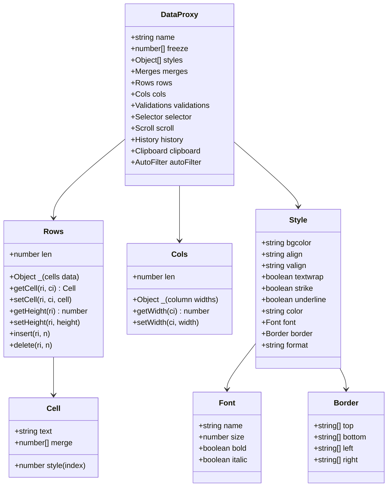

---

## Formulas Reference

### Built-in Formulas

The spreadsheet supports the following formulas:

#### Mathematical Functions

| Function | Syntax | Description |
|----------|--------|-------------|
| SUM | `=SUM(range)` | Sum of all values in range |
| AVERAGE | `=AVERAGE(range)` | Average of all values |
| MAX | `=MAX(range)` | Maximum value |
| MIN | `=MIN(range)` | Minimum value |
| COUNT | `=COUNT(range)` | Count numeric values |
| COUNTA | `=COUNTA(range)` | Count non-empty cells |

#### Logical Functions

| Function | Syntax | Description |
|----------|--------|-------------|
| IF | `=IF(condition, trueValue, falseValue)` | Conditional evaluation |
| AND | `=AND(cond1, cond2, ...)` | Returns true if all conditions are true |
| OR | `=OR(cond1, cond2, ...)` | Returns true if any condition is true |

#### Text Functions

| Function | Syntax | Description |
|----------|--------|-------------|
| CONCAT | `=CONCAT(text1, text2, ...)` | Concatenate text values |

### Formula Processing Flow

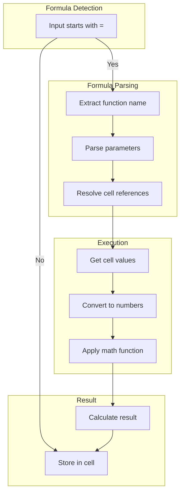

### Formula Examples

```javascript
// Basic arithmetic
=SUM(A1:A10)              // Sum A1 through A10
=AVERAGE(B2:B5)           // Average B2 through B5
=MAX(C1:C100)             // Maximum value in range
=MIN(D1:D50)             // Minimum value in range

// Conditional
=IF(A1>10, "Yes", "No")  // If A1 > 10, return "Yes"
=IF(A1="Active", 1, 0)   // Check cell value

// Multiple conditions
=AND(A1>0, B1>0)         // Both A1 and B1 are positive
=OR(A1="Yes", B1="Yes")  // Either A1 or B1 equals "Yes"

// Text
=CONCAT(A1, " ", B1)     // Concatenate with space
=CONCAT(FirstName, " ", LastName)

// Complex formulas
=SUM(A1:A10, C1:C10)    // Multiple ranges
=AVERAGE(IF(A1>0, A1, 0)) // Conditional average
```

### Cell References

| Reference Type | Example | Description |
|----------------|---------|-------------|
| Relative | A1 | Changes when copied |
| Absolute | $A$1 | Fixed when copied |
| Mixed Row | A$1 | Fixed row when copied |
| Mixed Column | $A1 | Fixed column when copied |

### Range Notation

| Range | Description |
|-------|-------------|
| A1:B10 | Continuous range |
| A:A | Entire column |
| 1:1 | Entire row |
| A1:D4, F1:G4 | Multiple ranges |

---

## Cell Formatting

### Text Formatting Properties

#### Horizontal Alignment

```javascript
{ align: 'left' | 'center' | 'right' }
```

| Value | Description |
|-------|-------------|
| `'left'` | Left aligned |
| `'center'` | Center aligned |
| `'right'` | Right aligned |

#### Vertical Alignment

```javascript
{ valign: 'top' | 'middle' | 'bottom' }
```

| Value | Description |
|-------|-------------|
| `'top'` | Top aligned |
| `'middle'` | Vertically centered |
| `'bottom'` | Bottom aligned |

#### Font Settings

```javascript
{
  font: {
    name: 'Arial',    // Font family
    size: 10,        // Font size (8-72)
    bold: true,       // Bold
    italic: true      // Italic
  }
}
```

#### Text Decorations

```javascript
{
  underline: true/false,
  strike: true/false,
  textwrap: true/false
}
```

| Property | Description | Shortcut |
|----------|-------------|----------|
| `underline` | Underlined text | Ctrl+U |
| `strike` | Strikethrough text | - |
| `textwrap` | Wrap text within cell | - |

### Number Format Types

| Format | Example Input | Example Output |
|--------|--------------|---------------|
| `'normal'` | 1234.567 | 1234.567 |
| `'text'` | 00123 | 00123 (preserved) |
| `'number'` | 1234.567 | 1,234.57 |
| `'percent'` | 0.25 | 25% |
| `'rmb'` | 1234.567 | ¥1,234.57 |
| `'usd'` | 1234.567 | $1,234.57 |
| `'eur'` | 1234.567 | €1,234.57 |

---

## Data Validation

### Validation Architecture

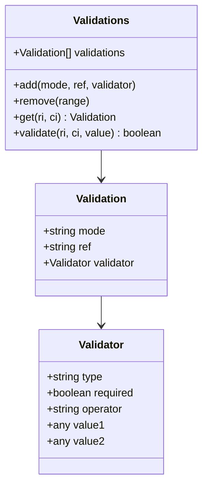

### Validation Types

```javascript
// Validation modes
{
  mode: 'list' | 'number' | 'date' | 'email' | 'phone' | 'custom'
}
```

### Validation Configuration

```javascript
// List validation (dropdown)
dataProxy.addValidation('list', 'A1:A10', {
  type: 'list',
  required: true,
  value: ['Option 1', 'Option 2', 'Option 3']
});

// Number validation with range
dataProxy.addValidation('number', 'B2:B100', {
  type: 'number',
  operator: 'between',
  value1: 0,
  value2: 1000
});

// Date validation
dataProxy.addValidation('date', 'C2:C100', {
  type: 'date',
  operator: 'greaterThan',
  value1: '2024-01-01'
});

// Email validation
dataProxy.addValidation('email', 'D2:D100', {
  type: 'email'
});
```

### Validation Operators

| Operator | Code | Description |
|----------|-----|-------------|
| between | `'be'` | Between two values |
| not between | `'nbe'` | Not between two values |
| less than | `'lt'` | Less than value |
| less than or equal | `'lte'` | Less than or equal |
| greater than | `'gt'` | Greater than |
| greater than or equal | `'gte'` | Greater than or equal |
| equal | `'eq'` | Equal to |
| not equal | `'neq'` | Not equal to |

---

## Keyboard Shortcuts

### Complete Shortcut Reference

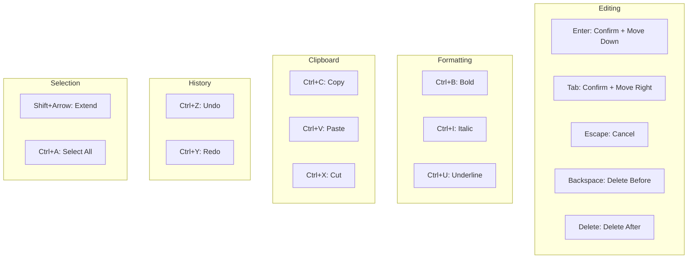

| Shortcut | Action | Description |
|---------|--------|-------------|
| Enter | Confirm edit, move down | Confirm cell edit, move to cell below |
| Tab | Confirm edit, move right | Confirm cell edit, move to next cell |
| Escape | Cancel edit | Cancel current edit, restore original value |
| Backspace | Delete before | Delete character before cursor |
| Delete | Delete after | Delete character after cursor |
| Alt+Enter | New line | Insert line break in cell |
| Arrow keys | Navigate | Move between cells |
| Ctrl+Arrow | Jump | Jump to edge of data region |
| Shift+Arrow | Extend selection | Extend selection by one cell |
| Ctrl+Shift+Arrow | Jump select | Extend selection to edge |
| Ctrl+A | Select all | Select entire sheet |
| Ctrl+B | Toggle bold | Toggle bold formatting |
| Ctrl+I | Toggle italic | Toggle italic formatting |
| Ctrl+U | Toggle underline | Toggle underline formatting |
| Ctrl+C | Copy | Copy selected cells |
| Ctrl+V | Paste | Paste from clipboard |
| Ctrl+X | Cut | Cut selected cells |
| Ctrl+Alt+V | Paste format | Paste format only |
| Ctrl+Shift+V | Paste value | Paste values only |
| Ctrl+Z | Undo | Undo last action |
| Ctrl+Y | Redo | Redo last action |
| Delete | Clear | Clear cell content |
| Ctrl+Shift+= | Insert | Open insert dialog |
| Ctrl+- | Delete | Open delete dialog |
| Home | First cell | Move to first cell in row |
| End | Last cell | Move to last cell in row with data |

---

## Toolbars Reference

### Toolbar Structure

```mermaid
flowchart TB
    subgraph Toolbar["Toolbar Components"]
        
        group1["Group 1: History"]
        G1A["Undo"]
        G1B["Redo"]
        G1C["Print"]
        G1D["Paint Format"]
        G1E["Clear Format"]
        
        group2["Group 2: Format"]
        G2A["Number Format"]
        
        group3["Group 3: Font"]
        G3A["Font Family"]
        G3B["Font Size"]
        
        group4["Group 4: Text Style"]
        G4A["Bold"]
        G4B["Italic"]
        G4C["Underline"]
        G4D["Strike"]
        G4E["Text Color"]
        
        group5["Group 5: Cell Style"]
        G5A["Fill Color"]
        G5B["Borders"]
        G5C["Merge"]
        
        group6["Group 6: Alignment"]
        G6A["Horizontal"]
        G6B["Vertical"]
        G6C["Text Wrap"]
        
        group7["Group 7: Data"]
        G7A["Freeze"]
        G7B["Filter"]
        G7C["Functions"]
        
    end
    
    Toolbar --> group1
    Toolbar --> group2
    Toolbar --> group3
    Toolbar --> group4
    Toolbar --> group5
    Toolbar --> group6
    Toolbar --> group7
```

---

## Context Menu Reference

### Context Menu Structure

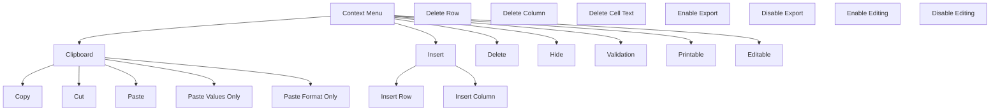

---

## Auto-Filter System

### Auto-Filter Architecture

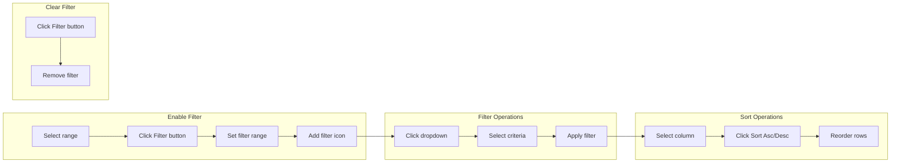

### Filter Configuration

```javascript
{
  ref: 'A1:D10',         // Filter range
  sort: {                // Sort configuration
    ci: 0,             // Column index
    order: 'asc' | 'desc'
  },
  filters: [            // Column filters
    {
      ci: 0,
      operator: 'eq' | 'ne' | 'gt' | 'lt' | ...,
      value: 'filter'
    }
  ]
}
```

---

## Freeze Panes

### Freeze Types Diagram

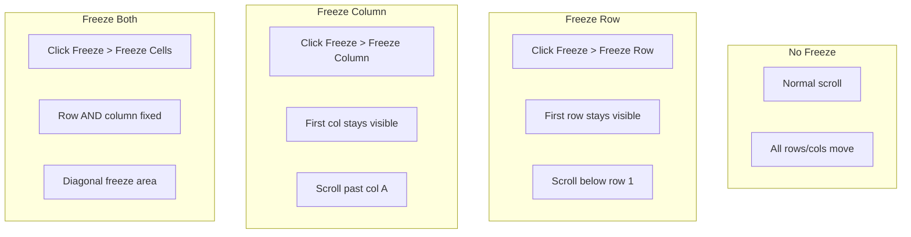

### Freeze Configuration

```javascript
// Freeze first row
dataProxy.setFreeze(1, 0);

// Freeze first column
dataProxy.setFreeze(0, 1);

// Freeze at B3 (row 2, column 1)
dataProxy.setFreeze(2, 2);
```

### Freeze Types

| Freeze Type | Code | Description |
|------------|------|-------------|
| None | `[0, 0]` | No freeze |
| Row | `[n, 0]` | Freeze n rows |
| Column | `[0, n]` | Freeze n columns |
| Both | `[n, m]` | Freeze rows and columns |

---

## Style Management

### Style System Architecture

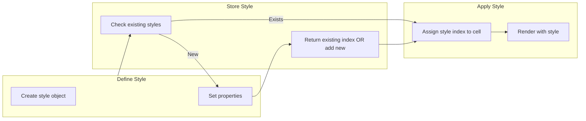

**Style Sharing Strategy:**

- Identical styles share a single index
- Reduces memory footprint
- Faster rendering

---

## Undo/Redo System

### History System Diagram

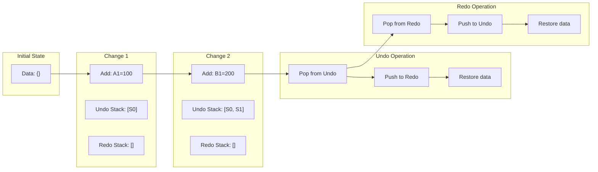

---

## Clipboard Operations

### Clipboard Flow Diagram

```mermaid
flowchart TB
    subgraph CopyProcess["Copy Process"]
        CP1["Get selection range"]
        CP2["Read cell data"]
        CP3["Format as TSV"]
        CP4["Copy to clipboard API"]
    end
    
    subgraph PasteProcess["Paste Process"]
        PP1["Get clipboard data"]
        PP2["Parse TSV content"]
        PP3["Calculate target range"]
        PP4["Validate target"]
        PP5["Copy data + format"]
    end
    
    subgraph ErrorCheck["Error Handling"]
        EC1["Check merged cells"]
        EC2["Check dimensions"]
    end
    
    CP1 --> CP2
    CP2 --> CP3
    CP3 --> CP4
    
    PP1 --> PP2
    PP2 --> PP3
    PP3 --> EC1
    EC1 --> EC2
    EC2 -->|Valid| PP4
    EC2 -->|Invalid| PPError["Show Error"]
```

---

## Internationalization

### Locale System

```mermaid
classDiagram
    class Locale {
        +string currentLang
        +Object messages
        +setLocale(lang, messages)
        +t(key) string
    }
    
    class Message {
        +toolbar: Object
        +contextmenu: Object
        +format: Object
        +formula: Object
        +validation: Object
        +error: Object
        +calendar: Object
        +button: Object
        +sort: Object
        +filter: Object
    }
    
    class Lang {
        +string code
        +string name
    }
    
    Locale --> Message
    Message --> Lang
```

### Supported Languages

| Code | Language |
|------|----------|
| `'en'` | English (default) |
| `'zh-cn'` | Chinese Simplified |
| `'zh-tw'` | Chinese Traditional |
| `'de'` | German |
| `'nl'` | Dutch |

---

## Rendering System

### Canvas Rendering Pipeline

```mermaid
flowchart LR
    subgraph Init["Initialization"]
        R1["Create canvas element"]
        R2["Get 2D context"]
        R3["Set device pixel ratio"]
    end
    
    subgraph Frame["Render Frame"]
        RF1["Clear canvas"]
        RF2["Save context state"]
    end
    
    subgraph Grid["Draw Grid"]
        RG1["Draw col headers"]
        RG2["Draw row headers"]
        RG3["Draw grid lines"]
    end
    
    subgraph Cell["Draw Cells"]
        RC1["For each visible row"]
        RC2["For each visible col"]
        RC3["Draw background"]
        RC4["Draw border"]
        RC5["Draw text"]
    end
    
    subgraph Selection["Draw Selection"]
        RS1["Draw highlight"]
        RS2["Draw active border"]
    end
    
    subgraph Restore["Restore"]
        RR1["Restore context state"]
    end
    
    R1 --> R2
    R2 --> R3
    
    R3 --> RF1
    RF1 --> RF2
    RF2 --> RG1
    RG1 --> RG2
    RG2 --> RG3
    RG3 --> RC1
    RC1 --> RC2
    RC2 --> RC3
    RC3 --> RC4
    RC4 --> RC5
    RC5 --> RS1
    RS1 --> RS2
    RS2 --> RR1
```

### Device Pixel Ratio Handling

```javascript
const dpr = window.devicePixelRatio || 1;

// Scale context
ctx.scale(dpr, dpr);

// Resize canvas
el.width = npx(width);
el.height = npx(height);

// CSS size
el.style.width = `${width}px`;
el.style.height = `${height}px`;
```

---

## Expression Parser

### Infix to Suffix Conversion

The expression parser converts mathematical expressions from infix notation (standard) to suffix notation (Reverse Polish Notation) for easier evaluation:

```mermaid
flowchart TB
    subgraph Input["Input: 9+(3-1)*3+10/2"]
        I1["Parse character by character"]
    end
    
    subgraph Process["Processing"]
        P1["Push operands to stack"]
        P2["Push operators to operator stack"]
        P3["Handle parentheses"]
        P4["Apply operator precedence"]
    end
    
    subgraph Output["Output: 9 3 1-3*+ 10 2/"]
        O1["Pop remaining operators"]
        O2["Return suffix expression"]
    end
    
    I1 --> P1
    P1 --> P2
    P2 --> P3
    P3 --> P4
    P4 --> O1
    O1 --> O2
```

### Algorithm

```javascript
// src: include chars: [0-9], +, -, *, /
// Input: 9+(3-1)*3+10/2
// Output: 9 3 1-3*+ 10 2/
const infix2suffix = (src) => {
  const operatorStack = [];
  const stack = [];
  
  for (let i = 0; i < src.length; i += 1) {
    const c = src.charAt(i);
    
    if (c >= '0' && c <= '9') {
      stack.push(c);                    // Push operand
    } else if (c === ')') {
      let c1 = operatorStack.pop();
      while (c1 !== '(') {
        stack.push(c1);             // Pop until (
        c1 = operatorStack.pop();
      }
    } else {
      // Priority: */ > +-
      if (operatorStack.length > 0 && (c === '+' || c === '-')) {
        const last = operatorStack[operatorStack.length - 1];
        if (last === '*' || last === '/') {
          while (operatorStack.length > 0) {
            stack.push(operatorStack.pop());
          }
        }
      }
      operatorStack.push(c);            // Push operator
    }
  }
  
  while (operatorStack.length > 0) {
    stack.push(operatorStack.pop());
  }
  
  return stack;
};
```

---

## Performance Optimization

### Performance Strategies

```mermaid
flowchart TB
    subgraph Virtual["Virtual Scrolling"]
        V1["Calculate visible range"]
        V2["Skip off-screen cells"]
        V3["Only render visible"]
    end
    
    subgraph Style["Style Sharing"]
        S1["Check identical styles"]
        S2["Return existing index"]
        S3["Reduce memory"]
    end
    
    subgraph Sparse["Sparse Storage"]
        SP1["Store only non-empty"]
        SP2["Skip empty cells"]
        SP3["Reduce memory"]
    end
    
    subgraph Batch["Batch Updates"]
        B1["Use loadData()"]
        B2["Single re-render"]
        B3["Better performance"]
    end
    
    Virtual --> V1
    V1 --> V2
    V2 --> V3
    
    Style --> S1
    S1 --> S2
    S2 --> S3
    
    Sparse --> SP1
    SP1 --> SP2
    SP2 --> SP3
    
    Batch --> B1
    B1 --> B2
    B2 --> B3
```

### Best Practices

1. **Reduce default rows/columns**: Set minimum necessary
2. **Use lazy loading**: Load data on demand
3. **Batch updates**: Use loadData() instead of individual updates
4. **Disable unnecessary features**: Hide toolbar, grid when not needed
5. **Limit viewport**: Use view dimensions for limited viewport

---

## Common Patterns

### Data Persistence Pattern

```javascript
// Auto-save on change
spreadsheet.change((data) => {
  localStorage.setItem('spreadsheet-data', JSON.stringify(data));
});

// Load on init
const saved = localStorage.getItem('spreadsheet-data');
if (saved) {
  spreadsheet.loadData(JSON.parse(saved));
}
```

### Export to JSON Pattern

```javascript
const exportData = () => {
  const data = spreadsheet.getData();
  const json = JSON.stringify(data, null, 2);
  const blob = new Blob([json], { type: 'application/json' });
  const url = URL.createObjectURL(blob);
  const a = document.createElement('a');
  a.href = url;
  a.download = 'spreadsheet.json';
  a.click();
};
```

### Import from JSON Pattern

```javascript
const importData = (file) => {
  const reader = new FileReader();
  reader.onload = (e) => {
    const data = JSON.parse(e.target.result);
    spreadsheet.loadData(data);
  };
  reader.readAsText(file);
};
```

### Export to CSV Pattern

```javascript
const exportCSV = () => {
  const data = spreadsheet.getData();
  const rows = data[0].rows;
  let csv = '';
  
  for (let i = 0; i < rows.len; i += 1) {
    const row = rows[i];
    if (row && row.cells) {
      const values = Object.values(row.cells);
      csv += values.map(v => v.text).join(',') + '\n';
    }
  }
  
  const blob = new Blob([csv], { type: 'text/csv' });
  const url = URL.createObjectURL(blob);
  const a = document.createElement('a');
  a.href = url;
  a.download = 'spreadsheet.csv';
  a.click();
};
```

---

## Troubleshooting

### Common Issues Flowchart

```mermaid
flowchart TB
    subgraph Issue["Common Issues"]
        I1["Formulas Not Calculating"]
        I2["Paste Not Working"]
        I3["Performance Issues"]
        I4["CSS Not Loading"]
        I5["Cells Not Editable"]
    end
    
    subgraph Solution1["Formulas"]
        S1A["Check = prefix"]
        S1B["Verify references"]
        S1C["Check syntax"]
    end
    
    subgraph Solution2["Paste"]
        S2A["Use HTTPS"]
        S2B["Check permissions"]
        S2C["Try right-click"]
    end
    
    subgraph Solution3["Performance"]
        S3A["Reduce defaults"]
        S3B["Disable features"]
        S3C["Limit viewport"]
    end
    
    subgraph Solution4["CSS"]
        S4A["Include CSS"]
        S4B["Check paths"]
        S4C["Verify load order"]
    end
    
    subgraph Solution5["Editable"]
        S5A["Check mode option"]
        S5B["Check validation"]
    end
    
    I1 --> S1A
    S1A --> S1B
    S1B --> S1C
    
    I2 --> S2A
    S2A --> S2B
    S2B --> S2C
    
    I3 --> S3A
    S3A --> S3B
    S3B --> S3C
    
    I4 --> S4A
    S4A --> S4B
    S4B --> S4C
    
    I5 --> S5A
    S5A --> S5B
```

---

## Migration Guide

### Migration from DOM-based Spreadsheets

```mermaid
flowchart LR
    subgraph Before["Before (DOM-based)"]
        B1["<table> element"]
        B2["<td> cells"]
        B3["Manual rendering"]
    end
    
    subgraph Migration["Migration"]
        M1["Add container div"]
        M2["Install library"]
        M3["Create instance"]
    end
    
    subgraph After["After (Canvas)"]
        A1["<div id='xlsx'>"]
        A2["x-spreadsheet"]
        A3["Canvas rendering"]
    end
    
    B1 --> M1
    B2 --> M2
    B3 --> M3
    
    M1 --> A1
    M2 --> A2
    M3 --> A3
```

### Code Comparison

**Before (DOM):**
```javascript
const table = document.createElement('table');
const row = document.createElement('tr');
const cell = document.createElement('td');
cell.textContent = 'Value';
table.appendChild(row);
```

**After (x-spreadsheet):**
```javascript
const spreadsheet = Spreadsheet('#container');
spreadsheet.loadData([{
  rows: {
    1: { cells: { 0: { text: 'Value' } } }
  }
}]);
```

---

## API Summary

### Quick Reference

```javascript
// Create
new Spreadsheet('#id', options)

// Load data
.loadData([{...}])

// Get data
.getData()

// Cell operations
.cellText(r, c, text)
.cell(r, c)
.cellStyle(r, c)

// Events
.on('event', callback)
.change(callback)

// Utility
.reRender()
.deleteSheet()

// Static
Spreadsheet.locale('lang')
```

---

## License

MIT License

---

## Changelog

### Version 1.0.20

- Initial stable release
- Canvas rendering
- Formulas support
- Multi-sheet support
- Data validation
- Auto-filter
- Freeze panes
- Undo/Redo
- Context menu

---

## Contributing

Issues and pull requests welcome on GitHub.

---

## Support

For issues: https://github.com/myliang/x-spreadsheet/issues